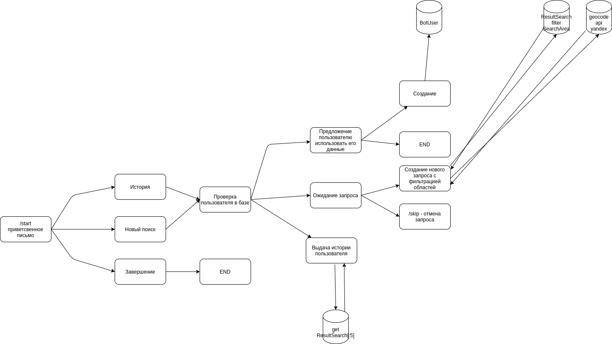

#Бот, который выводит полный адрес по короткому запросу и использованием API Яндекс карт

https://t.me/SearchYABot

# Описание разработки бота и панели администратора

1. Бот https://github.com/Khanze99/search_service_ya/blob/main/search_service/search_service_api/management/commands/bot.py
2. Модели https://github.com/Khanze99/search_service_ya/blob/main/search_service/search_service_api/models.py



Старт процесса /start
В процессе логики бота, команда /start возвращает в начальное состояние или стартует процесс.

Для того чтобы дать права на просмотр | просмотр + удаление разрешенных областей поиска

0. Логин в панель Админа
1. Создание пользователя
2. В панели заходим в модель PermissionUser и выбираем соответсвующие права для пользователя

На самом деле можно сделать лучше, но пока по времени не успеваю.
1. Кастомизировать админку, добавив туда нашу модель с флажками, типо TabularInlines
2. Переопределить пользователя, все норм, только были небольшие трудности в логине и работе с ним, нужно побольше времени чтобы разобраться
3. Создать сервис с Менеджерами и Пользователями


# Инструкция по развертыванию проекта

```
sudo apt update
sudo apt upgrade

sudo apt install python3-pip python3-dev libpq-dev postgresql postgresql-contrib nginx curl vim

```

Установка и настройка POstgreSQL https://docs.google.com/document/d/144Im71o_iJnTlwudAgOyDWQGOMrNst6_8nkBtI9JlZc/edit?usp=sharing

Виртуальная среда 

```
sudo -H pip3 install --upgrade pip
sudo -H pip3 install virtualenv
virtualenv venv
source venv/bin/activate

pip3 install -r requirements.txt
```


* git pull https://github.com/Khanze99/search_service_ya
* Настроить ALLOWED_HOSTS, добавить ip нашего сервера
* создать в seacrh_service, где у нас хранится settings.py, файл .env и добавить нужные параметра
```
TELEGRAM_TOKEN=token
YANDEX_GEOCODER_TOKEN=token
POSTGRES_DB=dbname
POSTGRES_USER=user
POSTGRES_PASSWORD=pass
POSTGRES_HOST=localhost
POSTGRES_PORT=5432

```

* python3 manage.py migrate
* python3 manage.py collectstatic
* создание суперпользователя
```
python3 manage.py createsuperuser
```

* Создание systemd Socket и Service Files для Gunicorn
Создайте и откройте служебный файл systemd для Gunicorn в редакторе
```
sudo vim /etc/systemd/system/gunicorn.service

```
добавив туда 

```
[Unit]
Description=gunicorn daemon
After=network.target

[Service]
User=root
Group=www-data
WorkingDirectory=/path/to/working/directory/search_service
ExecStart=/path/to/execstart/directory/venv/bin/gunicorn --access-logfile - --workers 3 --bind unix:/path/to/appwsgi/directory/search_service/gunicorn.sock search_service.wsgi:application

```

Теперь можно запустить созданную службу Gunicorn и включить ее так, чтобы она запускалась при загрузке:

```
sudo systemctl start gunicorn
sudo systemctl enable gunicorn

```

Далее проверьте есть ли наш сокет в проекте
```
ls 
Output: manage.py  search_service  search_service_api  gunicorn.sock  static

```

Так же можете проверить состояние процесса

```
sudo systemctl status gunicorn

```

* Настройка Nginx

```
sudo nano /etc/nginx/sites-enabled/ssya.conf

```

Вставив туда отредактированные под систему строки

```
server {
listen 80;
server_name localhost;

location = /favicon.ico { access_log off; log_not_found off; }
location /static/ {
root /path/to/project/search_service_ya/search_service;
}

location / {
include proxy_params;
proxy_pass http://unix:/path/to/project/search_service_ya/search_service/gunicorn.sock;
}
}

```

Проверка на наличие синтаксических ошибок:

```
sudo nginx -t

```

Если все ок, перезапускаем веб-сервер:
```
sudo systemctl restart nginx

```

* Запуск бота в проекте в окружении django
```
python3 manage.py bot
```
Но такой метод довольно гемморойный.
Нужно по идее засунуть в docker-compose и запускать с оркестрацией сервисов.

